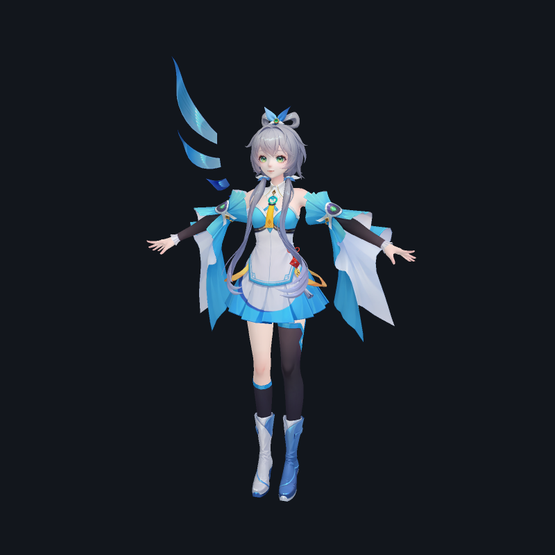

# TinyRenderer

这是我在学习 C++ 和计算机图形学过程中整理的一个 CPU 软件光栅化渲染器。项目参考了
ssloy/tinyrenderer 的学习思路，从画线和三角形填充开始，逐步加入模型加载、坐标变换、
深度测试、纹理采样和基础光照，最后将渲染结果保存为 PNG 或 TGA 图片。

渲染过程由 CPU 完成，不调用 OpenGL、DirectX 或 Vulkan，也不需要额外安装第三方库。
目前项目通过命令行运行，主要用于学习和演示基础渲染流程。


我希望通过这个项目理解“一个三维模型如何变成二维图像”，同时练习 C++ 的数据组织、
接口设计和模块拆分。下面介绍已实现的功能、运行方法，以及实现过程中几个值得说明的设计。

---

## 目录

- [项目展示与实现范围](#项目展示与实现范围)
- [功能特性](#功能特性)
- [效果展示](#效果展示)
- [快速开始](#快速开始)
- [命令行参数](#命令行参数)
- [渲染管线原理](#渲染管线原理)
- [代码结构](#代码结构)
- [素材来源与署名](#素材来源与署名)
- [已知简化与可扩展方向](#已知简化与可扩展方向)

---

## 项目展示与实现范围

如果是第一次查看这个项目，可以先看效果图，再按照[演示步骤](docs/demo.md)构建和运行。
想了解代码组织，可以阅读[类图与职责说明](docs/TinyRenderer详细类图与职责说明.md)；
公式和常见问题整理在[技术复盘笔记](docs/TinyRenderer项目技术点与面试准备.md)中。

项目是在参考教学代码的基础上学习和扩展的，几何模板与 TGA 读写并非完全独立原创。
仓库中整理和扩展的工作主要包括：

| 工作内容 | 代码入口 | 展示时可以验证的结果 |
|---|---|---|
| OBJ / MTL 加载与多模型场景组织 | `model.cpp`、`scene.cpp` | 头部和眼球保持相对位置，不同面使用对应材质 |
| 光栅化与着色器接口组织 | `our_gl.cpp`、`shaders.cpp` | 切换着色模式，观察深度、UV 和法线 |
| 阴影与抗锯齿接入 | `scene.cpp`、`shaders.cpp` | 对比阴影开关与不同 SSAA 倍率 |
| 角色素材适配与问题修复 | `texture.cpp`、`shaders.cpp`、`main.cpp` | 修正纹理 V 方向、光照颜色空间，并提供 MMD 参数预设 |
| 构建和使用说明整理 | `CMakeLists.txt`、`build.bat`、`docs/` | 从源码构建并复现示例图片 |

这些内容是当前代码的实现范围，不代表实现了完整游戏引擎或 MMD 渲染系统。
我更希望通过演示说明数据如何流动，以及遇到贴图错位、画面偏暗等问题时如何定位原因。

### 当前角色演示



上图由当前程序以 `800×800`、`--ssaa 2` 和 `--mmd` 参数生成。
模型与贴图为第三方素材，来源状态见下方素材说明；角色模型制作不计入项目代码工作。

### 可追溯的迭代

| 提交 | 内容 |
|---|---|
| [66e6ad9](https://github.com/March-teacher/TinyRenderer/commit/66e6ad9) | 从线框演示扩展到带材质、光照和阴影的光栅化流程 |
| [71b0ed9](https://github.com/March-teacher/TinyRenderer/commit/71b0ed9) | 增加 CMake 构建，拆分核心库和程序入口 |
| [52a46fd](https://github.com/March-teacher/TinyRenderer/commit/52a46fd) | 修正纹理方向与光照颜色处理，加入 MMD 预设 |
| [a163cc3](https://github.com/March-teacher/TinyRenderer/commit/a163cc3) | 加入洛天依演示素材并配置默认运行参数 |

本次展示整理与验证记录见 [2026-09-16 更新说明](docs/update-2026-09-16.md)。

## 功能特性

**几何与资源**

- OBJ 解析：顶点 / 纹理坐标 / 法线 / 面 / 折线，支持负数索引与 `v//vn` 缺省写法
- 多边形面的扇形三角化；凹多边形可能处理不正确，建议导出模型时先三角化
- MTL 材质库：`Kd` / `Ks` / `Ns` / `map_Kd` / `map_Ks` / `map_Bump`，逐面材质归属
- 贴图按命名约定自动发现（`*_diffuse.tga` / `*_nm_tangent.tga` / `*_nm.tga` / `*_spec.tga`）
- 模型缺少法线时自动生成**面积加权平滑法线**
- **多模型场景**：整体统一归一化，保持模型之间的相对位置

**变换与光栅化**

- 坐标变换流程：模型 → 世界 → 观察 → 裁剪 → NDC → 屏幕
- 透视 / 正交两套投影矩阵
- 近平面裁剪（Sutherland–Hodgman），处理三角形跨越近平面时的投影问题
- 重心坐标光栅化 + **z-buffer 深度测试**
- **透视校正插值**（顶点属性除以 w 再归一化）
- 根据屏幕空间有向面积进行背面剔除

**着色**

- 顶点与片元着色器接口（`vertex()` / `fragment()`），便于复用光栅化流程
- 线框、Flat、Gouraud、Phong，以及法线、UV、深度调试视图
- Blinn-Phong 光照：环境光 + 漫反射 + 高光
- **切线空间法线贴图**（Darboux 标架，无需预计算逐顶点切线）
- 漫反射贴图 / 高光贴图 / **双线性纹理采样**
- 光照计算前将漫反射颜色从 sRGB 转为线性值，输出前再转回 sRGB
- MMD 显示预设：提高环境光，关闭高光、阴影和背面剔除，便于展示当前角色素材

**阴影、抗锯齿与输出**

- **阴影贴图**（两趟渲染 + 斜率相关 bias + 3×3 PCF 软化）
- **SSAA 超采样抗锯齿**（1×～4×）
- 输出 TGA（RLE 压缩）或 **PNG**（自带零依赖编码器）
- 深度缓冲可视化输出

---

## 效果展示

下面的图片用于展示不同功能，使用的模型和参数不一定与当前默认运行配置相同。

### 着色模型对比

使用同一模型对比面法线、顶点光照插值和逐像素光照的差别。

| Flat（平直） | Gouraud（逐顶点） | Phong（逐像素） |
|:---:|:---:|:---:|
|  |  |  |
| 每个三角形使用面法线，棱面较明显 | 在顶点计算漫反射强度，再进行插值 | 插值法线后计算光照，支持高光和法线贴图 |

### 法线贴图

法线贴图改变光照计算使用的法线方向，可以表现皱纹等表面细节，
但不会改变模型轮廓或增加几何面数。

| 关闭法线贴图 | 开启法线贴图 |
|:---:|:---:|
|  |  |

### 阴影贴图与多模型场景

头部、眼球、程序化地板是三个独立模型，被统一归一化后摆进同一个场景；
地板的作用就是把阴影"接住"，同时用棋盘格向远处的收缩体现透视投影。


### 调试视图

调试视图用于观察中间数据，帮助排查网格、纹理坐标和深度问题。

| 线框 | 纹理坐标 | 深度缓冲 |
|:---:|:---:|:---:|
|  |  |  |
| 没有深度测试，背面的边直接透出来——正好说明 z-buffer 解决了什么 | u→红、v→绿，能一眼看出 uv 的走向和接缝 | 近处亮、远处暗，伸出的左手最近 |

---

## 快速开始

### 环境要求

- Windows + Visual Studio（需勾选“使用 C++ 的桌面开发”）
- 支持 C++20 的 MSVC
- 使用 CMake 构建时，需要 CMake 3.20 或更新版本
- 无任何第三方依赖

### 构建

**方式一：Visual Studio**

使用支持 `.slnx` 格式的 Visual Studio 打开 `TinyRenderer.slnx`，选择 `Release | x64` 后生成。
若当前版本无法打开该格式，可以使用下方的 CMake 方式生成解决方案。

VS 调试启动已默认使用 `obj\luotianyi\luotianyi.obj --mmd`，工作目录为仓库根目录，按 F5 可以直接渲染仓库内的洛天依素材。

**方式二：命令行**

```bat
build.bat            :: Release 构建（/O2）
build.bat debug      :: Debug 构建（/Od /Zi）
```

`build.bat` 会自动通过 `vswhere` 定位 MSVC 环境，产物是仓库根目录下的 `renderer.exe`。

**方式三：CMake**

```bat
cmake -S . -B build\cmake-vs -A x64
cmake --build build\cmake-vs --config Release
```

CMake 会生成 `tinyrenderer_lib` 和 `renderer` 两个 target：核心渲染代码放在库中，命令行入口单独链接该库。后续添加单元测试时，可以直接复用 `tinyrenderer_lib`。
CMake 生成的 Visual Studio 工程同样带有默认调试参数：`obj\luotianyi\luotianyi.obj --mmd`。

上述命令适用于 Visual Studio 生成器。构建后可从仓库根目录运行
`build\cmake-vs\Release\renderer.exe`。

如果 `cmake` 不在 `PATH` 中，可以使用 Visual Studio 自带的 CMake，或将其所在目录加入 `PATH`。

### 运行

以下示例使用 `build.bat` 生成的程序，请在仓库根目录执行，以便找到相对路径下的素材。

```bat
:: 默认渲染仓库内的洛天依素材
renderer.exe

:: 显式指定洛天依素材，使用 MMD 兼容预设
renderer.exe obj\luotianyi\luotianyi.obj --mmd -o luotianyi.png

:: 最简单的一次渲染
renderer.exe obj\african_head\african_head.obj -o head.png

:: 加上眼球和地板，看阴影
renderer.exe obj\african_head\african_head.obj ^
             obj\african_head\african_head_eye_inner.obj ^
             --floor -o head.png

:: 换个模型，提高抗锯齿倍率
renderer.exe obj\diablo3_pose\diablo3_pose.obj --floor --ssaa 3 -o diablo.png

:: 线框模式
renderer.exe obj\diablo3_pose\diablo3_pose.obj -s wire -o wire.png

:: 对比法线贴图的效果
renderer.exe obj\african_head\african_head.obj --no-normal-map -o off.png
renderer.exe obj\african_head\african_head.obj                 -o on.png
```

完全不传参数时，渲染器会默认加载 `obj\luotianyi\luotianyi.obj` 并应用 `--mmd` 预设。
指定输出路径或其他参数时，请同时传入 OBJ 路径。默认图片保存到当前工作目录。

渲染自己的素材时，需要准备 OBJ、对应的 MTL 和 TGA 贴图，并检查材质名称、贴图路径和 UV。
程序不能直接读取 PMX，也不会导入 Blender 的节点材质、骨骼或动画。
`--mmd` 只是现有渲染流程的一组参数，不包含完整的 MMD 材质或 Toon 着色系统，
因此渲染结果与原模型软件中的效果仍会有差别。

---

## 命令行参数

```
renderer [选项] <模型.obj> [更多模型.obj ...]
renderer
```

### 输出

以下表格列出普通配置的默认值。无参数启动会应用 MMD 预设，覆盖环境光、高光、阴影和背面剔除设置。

| 选项 | 说明 | 默认 |
|---|---|---|
| `-o, --output <文件>` | 输出图片，按后缀选 `.png` 或 `.tga` | `output.png` |
| `-w, --width <像素>` | 图像宽度 | `800` |
| `-H, --height <像素>` | 图像高度 | `800` |
| `--ssaa <1..4>` | 超采样抗锯齿倍率，`1` 即关闭 | `2` |
| `--dump-depth <文件>` | 额外输出一张深度缓冲可视化图 | 关 |

### 着色

| 选项 | 说明 | 默认 |
|---|---|---|
| `-s, --shader <模式>` | `wire`/`flat`/`gouraud`/`phong`/`normal`/`uv`/`depth` | `phong` |
| `--no-normal-map` | 关闭法线贴图 | 开启 |
| `--no-spec` | 关闭高光 | 开启 |
| `--shininess <值>` | 覆盖材质的高光指数 `Ns` | 用材质值 |
| `--checker` | 强制使用程序化棋盘格作为漫反射贴图 | 关 |
| `--mmd` | 环境光设为 `0.62`，关闭高光、阴影和背面剔除 | 无参数运行时启用 |

### 相机

| 选项 | 说明 | 默认 |
|---|---|---|
| `--eye x,y,z` | 相机位置 | `1,0.55,3.2` |
| `--center x,y,z` | 观察目标 | `0,0,0` |
| `--up x,y,z` | 上方向 | `0,1,0` |
| `--fov <角度>` | 垂直视场角 | `40` |

### 光照与场景

| 选项 | 说明 | 默认 |
|---|---|---|
| `--light x,y,z` | 平行光方向（**由表面指向光源**） | `1,1,1` |
| `--ambient <0..1>` | 环境光强度 | `0.18` |
| `--no-shadow` | 关闭阴影贴图 | 开启 |
| `--floor` | 添加程序化棋盘格地板 | 关 |
| `--no-cull` | 关闭背面剔除 | 开启 |
| `--no-fit` | 不把场景归一化到单位立方体 | 开启归一化 |

---

## 渲染管线原理

这一节按数据流介绍主要实现，方便结合源码理解。项目按资源加载、光栅化、着色器和场景管理
拆分模块，让不同着色方式复用相同的三角形填充流程。线框模式则单独绘制边线。

### 0. 坐标空间速查

| 空间 | 含义 |
|---|---|
| 模型空间 | OBJ 文件里的原始坐标 |
| 世界空间 | 多个模型摆到一起后的公共坐标系（本项目在加载后一次性烘焙好） |
| 观察空间 | 以相机为原点，相机沿 **-z** 方向看 |
| 裁剪空间 | 乘上投影矩阵之后、做透视除法之前的齐次坐标 `(x,y,z,w)` |
| NDC | 裁剪空间除以 `w` 的结果，可见范围是 `[-1,1]³` |
| 屏幕空间 | `x,y` 是像素坐标，`z` 是 `[0,1]` 的深度值 |

### 1. 场景归一化 —— `scene.cpp: fit_to_unit_cube()`

不同来源的模型尺度可以差几个数量级。加载后先把**整个场景**（而不是每个模型各自）
平移到原点、按最长边等比缩放进 `[-1,1]³`。

必须整体做的原因很实际：`african_head` 和它的眼球是两个独立 OBJ，
如果各自归一化，眼球会被放大到和脑袋一样大。

### 2. 观察变换 —— `our_gl.cpp: lookat()`

为相机建立一组标准正交基 `(x, y, z)`，其中 `z` 指向相机背后（约定相机沿 -z 看）。
将相机基向量按列排列得到相机方向到世界方向的旋转矩阵 `R`。因为 `R` 是正交矩阵，
其逆等于转置，所以把基向量按行排列就得到世界方向到相机方向的变换 `R⁻¹`，
再与将 `eye` 移到原点的平移变换组合；对顶点而言，先平移，再变换到相机基底。

### 3. 投影变换 —— `our_gl.cpp: perspective()`

```
| f/aspect   0            0                    0          |
|    0       f            0                    0          |
|    0       0   (zfar+znear)/(znear-zfar)   2·zfar·znear/(znear-zfar) |
|    0       0           -1                    0          |
```

关键在最后一行 `(0,0,-1,0)`：它把观察空间的 `-z`（也就是到相机的距离）搬进了 `w` 分量。
后面光栅化阶段做的"除以 `w`"，实际就是"除以深度"——**近大远小正是从这里来的**。
第三行则把 `z` 重新映射到 NDC 的 `[-1,1]`，好让深度缓冲有固定取值范围。

平行光的阴影贴图必须换用正交投影：平行光的光线本来就互相平行，没有汇聚中心，
用透视投影会让阴影像点光源打出来的一样发散。

### 4. 顶点着色器 —— `shaders.cpp`

对三角形的各个顶点调用顶点着色器，输出裁剪空间坐标，并保存需要插值的属性
（UV、法线、世界坐标等）。这个接口借鉴了图形管线中顶点与片元处理分离的思路。

法线有个坑：**法线不能直接乘变换矩阵 `M`，要乘 `M` 的逆转置矩阵**。
反例很直观——把球体沿 x 方向压扁，表面变陡，法线应当朝 x 方向"张开"；
但直接乘 `M` 会把法线也一起压扁，方向恰好错反。只有 `M` 是正交变换（纯旋转）时两者才相等。
（见 `model.cpp: transform()`，复用了 `geometry.h` 里的 `invert_transpose()`。）

### 5. 近平面裁剪 —— `our_gl.cpp: clip_against_near_plane()`

当前只显式裁剪近平面，屏幕包围盒限制了画布外的像素遍历范围。
这不等同于完整的六平面视锥裁剪。优先处理近平面，是因为顶点越过相机后，
`w` 可能为零或负数，直接进行透视除法会产生异常投影。

近平面在 NDC 里是 `z/w = -1`，即 `z + w = 0`，于是判据就是 `d(v) = v.z + v.w ≥ 0`。

裁剪会产生新顶点，因此还需要保留属性插值所需的信息。本项目为新顶点保存其在原三角形中的
重心坐标，光栅化时再将权重换算回原三角形。这样，着色器可以继续使用原来的顶点属性，
裁剪模块也不必逐一处理不同着色器的属性类型。

### 6. 透视除法与视口变换

裁剪空间坐标除以 `w` 得到 NDC，再乘视口矩阵映射到像素坐标，
同时把 `z` 从 `[-1,1]` 压到 `[0,1]`。

### 7. 光栅化 —— `our_gl.cpp: rasterize_sub_triangle()`

遍历三角形的屏幕包围盒（与画布求交，顺带完成上下左右的裁剪），
对每个像素中心算重心坐标；任一分量为负说明落在三角形外。

**背面剔除**：屏幕空间有向面积为负即视为背面。对封闭模型来说背面本来就会被正面挡住，
提前剔除可以减少后续计算，实际收益取决于模型和观察方向。

**深度测试**：z 值更小者胜出，写入 z-buffer 和颜色缓冲。

### 8. 透视校正插值

顶点属性（uv、法线……）在**三维空间**里线性变化，但投影是非线性的，
所以它们在屏幕上不再线性。正确的插值权重是

```
bc_clip[i] = (bc_screen[i] / w[i]) / Σⱼ (bc_screen[j] / w[j])
```

少了这一步，斜置平面上的贴图会明显扭曲——就是经典的"仿射贴图"瑕疵。

反过来，**深度插值恰恰要用未经校正的 `bc_screen`**：
屏幕空间中真正随 `x,y` 线性变化的量是 `z/w`，而 `screen[i].z` 已经是除过 `w` 的结果。

### 9. 片元着色器 —— `shaders.cpp: PhongShader::fragment()`

逐像素依次完成：

1. **法线插值** —— 插值会让向量长度缩短（两个单位向量的中点长度 < 1），必须重新归一化，
   否则光强会莫名偏暗。
2. **切线空间法线贴图** —— 见下一节。
3. **漫反射** —— 兰伯特余弦定律 `max(0, n·l)`。
4. **高光** —— Blinn-Phong：用半程向量 `h = normalize(l + v)` 与法线的夹角衡量高光，
   而不是原始 Phong 的"反射向量与视线夹角"。少算一次反射，掠射角下也更稳定。
5. **阴影查询** —— 见后。
6. **合成** —— 环境光不受阴影影响（它代表来自四面八方的间接光），漫反射和高光才乘可见度。

### 10. 切线空间与 Darboux 标架

法线贴图存的是"相对于表面局部坐标系的扰动"，要用它就得先在世界空间里
把这个局部坐标系构造出来：法线 `n` 已知，还缺切线 `t` 和副切线 `b`。

`t` 的定义是"沿着 `u` 增长最快的方向"。设三角形两条边为 `e₁`、`e₂`，
对应的 uv 差为 `du₁`、`du₂`，则

```
e₁ · t = du₁
e₂ · t = du₂
n  · t = 0
```

写成矩阵形式 `A·t = (du₁, du₂, 0)`，其中 `A` 的三行分别是 `e₁`、`e₂`、`n`，求逆即得 `t`；
把右端换成 `dv` 就得到 `b`。

标架由当前三角形的数据推导，不需要额外存储逐顶点切线。
这便于理解法线贴图的坐标转换，但退化 UV 和切线约定差异仍可能影响效果。

### 11. 阴影贴图 —— `scene.cpp` + `shaders.cpp: shadow_factor()`

**第一趟**：把相机搬到光源位置，用正交投影渲染一张深度图，
记下完整的变换链 `M_shadow = Viewport · Projection · ModelView`。

**第二趟**：着色时把像素的世界坐标用 `M_shadow` 变换到光源视角的屏幕空间，
如果它的深度明显大于深度图里记录的值，说明它和光源之间还夹着别的东西——处在阴影里。

两个必须处理的细节：

- **shadow acne（自遮蔽条纹）**：阴影图分辨率有限，一个阴影纹素覆盖了表面上一小片区域，
  该区域内所有像素都拿同一个深度值去比较。表面越倾斜，这片区域在深度上跨度越大，
  于是同一个面上会有一部分"自己挡住自己"，渲染出成片的斑马纹。
  解法是把比较阈值往光源方向挪一点，且**倾斜得越厉害挪得越多**（斜率相关 bias）。
- **PCF 软化**：只查一个纹素会得到非黑即白的硬边。改查 3×3 邻域再取平均，
  阴影边缘就得到 0～1 之间的过渡值，硬边被柔化成几像素宽的软边。

本项目在阴影趟关闭背面剔除，让背面也参与深度图生成，以适应包含薄片的演示模型。

### 12. 抗锯齿 —— `our_gl.cpp: downsample()`

一个像素本来就该是它覆盖范围内颜色的平均值，而单点采样只取了中心那一个样本，
于是几何边缘出现台阶。SSAA 的做法很直接：**先按 `factor²` 倍的采样密度渲染，
再把每个 `factor×factor` 的块求平均**。

它可以改善几何边缘和部分着色细节的锯齿，但中间图像的像素数会增加到 `factor²` 倍，
相应增加内存和计算开销；实际耗时还取决于场景。

---

## 代码结构

```
Project1/
├── geometry.h      向量 / 矩阵模板库：点积、叉乘、行列式、求逆、逆转置、齐次坐标升降维
├── tgaimage.h/cpp  TGA 图像的读写（含 RLE 编解码）
├── image_io.h/cpp  按后缀分发的图像保存；内含零依赖 PNG 编码器
├── texture.h/cpp   贴图采样：双线性插值、repeat 环绕、法线贴图解码、程序化棋盘格
├── model.h/cpp     OBJ/MTL 解析、三角化、法线生成、贴图发现、包围盒与变换
├── our_gl.h/cpp    ★ 管线核心：变换矩阵、IShader 抽象、近平面裁剪、光栅化 + z-buffer
├── shaders.h/cpp   ★ 各种着色器：Depth / Flat / Gouraud / Phong / Debug
├── scene.h/cpp     场景组装与渲染流程编排（阴影趟 → 主趟 → 降采样）
└── main.cpp        命令行解析、线框渲染，以及最早期的画线函数演进过程
```

主要职责可以概括为：

```
main        解析参数，组织程序入口和图片保存
scene       管理模型，安排阴影与主渲染流程
our_gl      执行裁剪和光栅化，调用着色器接口
shaders     读取模型属性和材质，计算片元颜色
model       管理网格、材质与纹理资源
```

`main.cpp` 里保留了 `line1` / `line2` / `line3` / `line` 四个版本的画线函数——
从"直接用参数方程采样"（采样密度和像素数对不上、有断点），
到"以 x 为参数"（斜率大时仍有断点），
到"交换 x/y 保证采样轴变化率更大"，
再到最终的"全整数 Bresenham"（消掉浮点参数 `t`）。
它们是这个项目的起点，也是最能说明"光栅化到底在做什么"的一段代码，因此原样留在这里；
线框模式用的就是最终版的 `line()`。

---

## 素材来源与署名

`obj/` 下的 `african_head` 和 `diablo3_pose` 来自 [ssloy/tinyrenderer](https://github.com/ssloy/tinyrenderer) 的素材集：

- **african_head** — © 2007 Vidar Rapp（<http://vidarrapp.se/>），作者已授权用于渲染器示例
- **diablo3_pose** — © Samuel (arshlevon) Sharit，作者已授权使用

两份素材各自的 `readme.txt` 保留了原始授权邮件，请遵循其中的条款。

几何模板库与 TGA 读写在 tinyrenderer 的公开教学代码基础上改写，项目在学习过程中扩展了
材质加载、场景组织、渲染选项和图片输出等功能。

`obj/luotianyi/` 是从 MMD 模型转换得到的 OBJ、MTL 和 TGA 演示素材，模型与贴图并非本人制作。
其作者、来源链接和具体授权信息仍需补充；本项目的代码说明不代表对该素材的授权。

---

## 已知简化与可扩展方向

目前项目以基础功能的学习与演示为主，仍有一些简化和未完成的部分。
下表列出它们对结果的影响，以及可能的改进方式；这些方向不代表已经实现。

| 简化 | 影响 | 如果要补 |
|---|---|---|
| 颜色过滤仍在 sRGB 数值上进行 | 双线性采样与 SSAA 的边缘混色不是严格线性的 | 后续可将纹理过滤和降采样也移入线性空间 |
| 纹理无 mipmap | 远处高频贴图容易出现锯齿和摩尔纹 | 预生成 mip 链并选择合适层级 |
| 单线程 | 大模型 + 高倍 SSAA 会比较慢 | 按屏幕横条分块并行，每线程一份着色器实例 |
| 只支持单个平行光 | 无法做多光源、点光源、聚光灯 | 光源列表 + 每个光源一张阴影图（点光源用立方体贴图） |
| 不支持透明 / alpha 混合 | `african_head_eye_outer`（角膜）会渲染成不透明白球 | 按深度排序 + 混合，或改用 alpha test |
| 凹多边形按扇形三角化 | 可能产生错误的三角形覆盖 | 导出前先三角化，或改用耳切法 |
| PNG 只用 deflate 的 stored 块 | 输出文件比真正压缩的 PNG 大数倍 | 实现 LZ77 + 霍夫曼编码；或用 `-o x.tga`（自带 RLE，文件小得多） |
| 无 SSAO / 全局光照 | 凹陷处缺少接触阴影，画面偏"平" | 屏幕空间环境光遮蔽，或路径追踪 |

此外，目前没有实时预览窗口、骨骼动画和完整的 MMD 材质支持，MTL 也只读取部分常用字段。

后续我希望先完善参数检查、素材加载报错和基础测试，再逐步尝试透明贴图裁切、mipmap 等功能。
现阶段更重要的目标，是能解释清楚已有实现，定位渲染问题，并验证修改是否有效。
