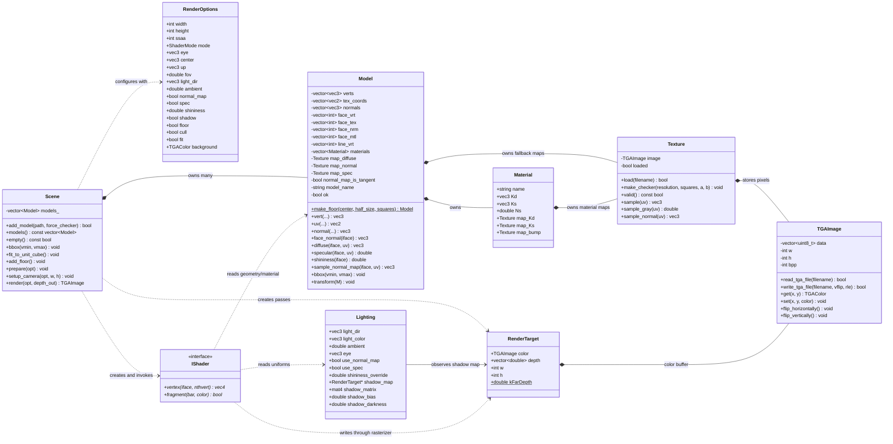
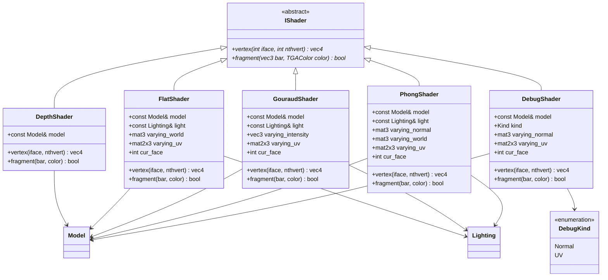
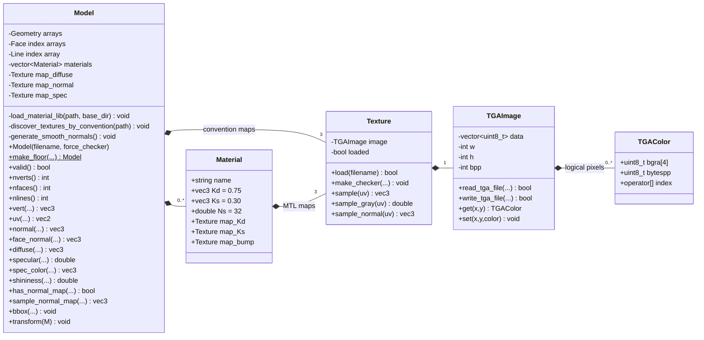
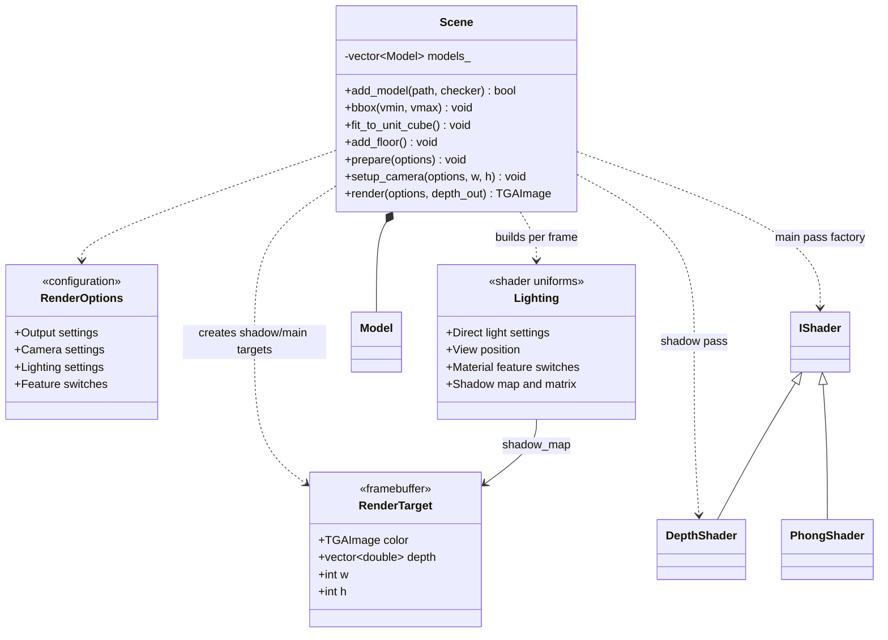
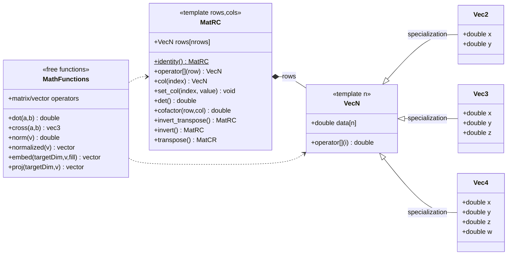
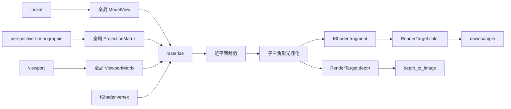
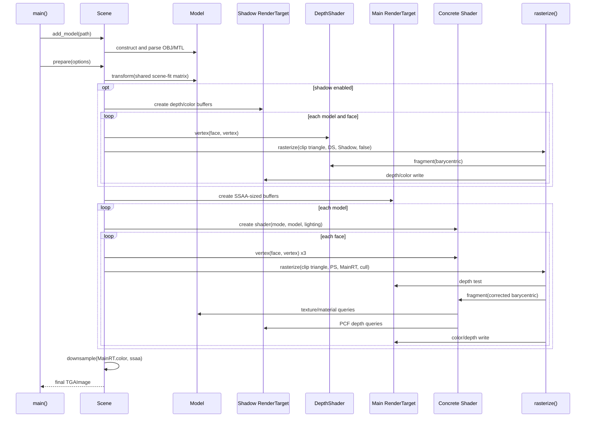
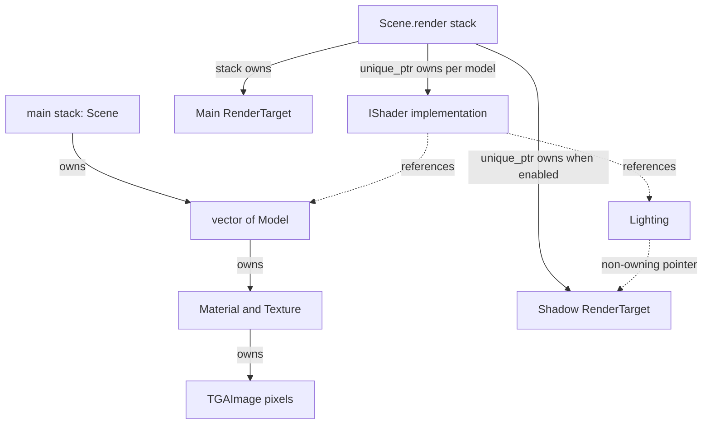

# TinyRenderer 详细类图与职责说明

> 基于当前 `Project1/` 源码整理。本文使用 Mermaid，可在支持 Mermaid 的 Markdown 编辑器中直接渲染。

## 1. 总体结构类图



### 总体关系解读

- `Scene` 是最高层编排者，拥有多个 `Model`，但不负责单个像素如何产生。
- `Model` 是几何与材质的数据源，内部拥有模型级 `Texture` 和多个 `Material`。
- `Material` 进一步拥有漫反射、高光和法线贴图。
- `Texture` 使用 `TGAImage` 保存像素，并提供采样语义。
- `IShader` 是渲染器和具体着色算法之间的接口。
- `RenderTarget` 聚合颜色缓冲和深度缓冲，是每个 Render Pass 的输出目标。
- `Lighting` 不拥有阴影图，只通过 `RenderTarget*` 在主渲染趟中观察阴影深度。

## 2. 着色器继承体系



### 各着色器职责

#### `IShader`

渲染器的扩展接口。`vertex()` 返回裁剪空间位置，`fragment()` 根据透视校正后的原三角形重心坐标生成颜色。光栅化器不关心具体光照模型。

#### `DepthShader`

阴影图第一趟专用。顶点阶段只做世界坐标到裁剪空间的变换；片元阶段返回固定白色，真正需要的是 `RenderTarget.depth`。它刻意不计算纹理和光照。

#### `FlatShader`

保存三角形三个世界坐标与 UV。片元阶段用两条边叉乘得到统一面法线，因此同一个三角形内光照一致，能清楚观察网格棱面。

#### `GouraudShader`

顶点阶段计算三个顶点的 Lambert 光强，片元阶段插值光强与 UV，再采样颜色并合成输出。当前实现不计算高光；一般的 Gouraud 高光实现也可能因顶点采样不足而漏掉三角形内部的窄高光。

#### `PhongShader`

主力着色器。顶点阶段写入世界坐标、法线和 UV；片元阶段依次完成：

1. varying 插值；
2. 法线重新归一化；
3. 可选法线贴图与 TBN 变换；
4. Lambert 漫反射；
5. Blinn-Phong 高光；
6. 阴影查询和 PCF；
7. 在线性空间合成环境光、漫反射与高光，再编码为 sRGB 输出。漫反射颜色在进入光照计算前解码为线性值。

#### `DebugShader`

把内部数据映射成颜色，支持 Normal 和 UV 两类视图。它不是最终视觉效果，而是定位法线翻转、UV 接缝、插值异常等问题的可视化诊断工具。

### Varying 的存放方式

每个着色器对象一次处理一个三角形，三个顶点属性按矩阵的列存放：

```text
varying_world.col(0) = 顶点 0 世界坐标
varying_world.col(1) = 顶点 1 世界坐标
varying_world.col(2) = 顶点 2 世界坐标

片元属性 = varying_world × barycentric
```

因此着色器实例含有可变的“当前三角形状态”，如果未来多线程按三角形渲染，每个线程或任务必须使用独立着色器实例。

## 3. 模型、材质与纹理类图



### `Model` 的详细职责

`Model` 同时承担资源加载结果和着色阶段数据接口两种职责：

- 解析 OBJ 的位置、UV、法线、面和折线；
- 将 OBJ 的 1-based/负数索引转换为内部 0-based 索引；
- 支持 `v/vt/vn`、`v//vn` 和属性缺失；
- 将任意凸多边形用三角扇拆成三角形；
- 解析 `mtllib` 和 `usemtl`，记录逐面材质下标；
- 无法线时生成面积加权平滑法线；
- 按 `_diffuse.tga`、`_nm_tangent.tga`、`_nm.tga`、`_spec.tga` 约定发现贴图；
- 对外提供按“面序号 + 面内顶点序号”的统一属性访问；
- 根据“材质贴图 → 模型级贴图 → 材质常量”回退；
- 计算 AABB；
- 对顶点应用普通齐次变换，对法线应用逆转置变换；
- 程序化构造接收阴影的棋盘格地板。

`face_vrt`、`face_tex`、`face_nrm` 是并行数组。OBJ 中同一个位置可在不同面引用不同 UV 或法线，所以三类索引不能假定相同。

### `Material` 的详细职责

`Material` 是 MTL 中一个 `newmtl` 块的内存表示：

- `Kd`：漫反射基色；
- `Ks`：高光颜色；
- `Ns`：高光指数；
- `map_Kd`：漫反射贴图；
- `map_Ks`：高光强度贴图；
- `map_bump`：项目按法线贴图解释的 bump/normal 资源。

它本身没有采样策略，采样与回退由 `Model` 统一对着色器提供。

### `Texture` 的详细职责

`Texture` 是图像像素与“纹理语义”之间的适配层：

- 负责加载 TGA；
- 使用 repeat 处理 UV 越界；
- 使用 2×2 纹素做双线性采样；
- UV 到纹素坐标时减 0.5，处理纹素中心；
- `sample_gray()` 将贴图作为标量读取；
- `sample_normal()` 将 RGB 从 `[0,1]` 解码到 `[-1,1]` 并归一化；
- 可生成程序化棋盘格。

### `TGAImage` 与 `TGAColor`

`TGAImage` 是底层像素容器，内部按连续字节保存图像。它负责 TGA 格式、RLE 和翻转，不理解 UV、法线或材质。`TGAColor` 以 BGRA 顺序保存最多四个通道；着色器输出 RGB 时要注意与内部 BGR 顺序转换。

## 4. 场景与渲染目标类图



### `RenderOptions`

这是应用层输入配置，基本与命令行参数一一对应，分为：

- 输出：宽、高、SSAA；
- 着色：ShaderMode、法线贴图、高光、shininess 覆盖；
- 相机：eye、center、up、FOV；
- 光照：方向、环境光；
- 场景开关：阴影、地板、背面剔除、自动归一化；
- 背景色。

它描述“用户想要什么”，不包含运行时生成的阴影图。

### `Lighting`

这是传给着色器的运行时 uniform 集合。除光照参数外，还包含：

- 当前相机世界坐标，用于视线和高光；
- 是否启用法线贴图/高光；
- 阴影深度缓冲观察指针；
- 世界坐标到阴影图屏幕空间的矩阵；
- bias 和阴影暗度。

它描述“当前 Render Pass 已准备好的光照状态”。

### `RenderTarget`

颜色缓冲与深度缓冲的聚合：

- `color`：最终或中间颜色；
- `depth`：一维连续深度数组；
- `w/h`：缓冲尺寸；
- `kFarDepth`：无穷远初值。

阴影趟和主趟都使用同一个类型，只是阴影趟主要消费 depth，主趟同时消费 color 和 depth。

### `Scene`

`Scene` 是 Facade/Orchestrator：

1. 加载并拥有模型；
2. 计算场景级 AABB；
3. 统一归一化所有模型；
4. 可选生成地板；
5. 配置主相机；
6. 从光源视角执行阴影 Pass；
7. 保存 shadow matrix，并构造 Lighting；
8. 根据 ShaderMode 创建具体着色器；
9. 执行主渲染 Pass；
10. 输出深度可视化并完成 SSAA 降采样。

## 5. 数学基础类型类图



说明：C++ 中 `vec<2>`、`vec<3>`、`vec<4>` 是模板特化，不是真正的运行时继承；图中的泛化箭头只是表达“由通用模板特化而来”。

### 向量类型

- 支持点积、加减、标量乘除、范数和归一化；
- `vec3` 支持叉积；
- `vec2/3/4` 以命名字段方便图形学代码表达；
- `embed<4>(p,1)` 将三维点升为齐次点；
- `embed<4>(d,0)` 表示不受平移影响的方向；
- `proj<3>()` 截取前三个分量，透视除法必须由调用者先完成。

### 矩阵类型

- 以行向量数组存储；
- 提供列读取与列写入，便于 varying 按列存三个顶点；
- 编译期维度限制矩阵乘法组合；
- 行列式由递归模板 `dt<n>` 计算；
- 逆矩阵通过余子式和伴随矩阵得到；
- `invert_transpose()` 直接支持法线变换。

这套实现适合 2×2、3×3、4×4 教学矩阵。对于大型矩阵或高数值稳定性场景，应使用 LU、QR 或成熟线性代数库。

## 6. 核心非成员函数与类的协作

项目并非所有逻辑都封装在类中。`our_gl.cpp` 的自由函数构成固定功能管线：



| 函数 | 责任 |
|---|---|
| `lookat()` | 生成世界到观察空间矩阵 |
| `perspective()` | 生成主相机透视投影矩阵 |
| `orthographic()` | 生成平行光阴影正交投影矩阵 |
| `viewport()` | NDC 映射到像素和 `[0,1]` 深度 |
| `rasterize()` | 近平面裁剪、透视除法、子三角形拆分 |
| `rasterize_sub_triangle()` | 包围盒、重心坐标、深度测试、透视校正、调用 fragment |
| `depth_to_image()` | 将有效深度范围归一化为可视灰度图 |
| `downsample()` | 对 SSAA 高分辨率颜色做盒式平均 |

全局矩阵使教学代码简洁，但隐藏了状态依赖，不利于多相机、多线程和嵌套渲染。工程化版本可引入 `RenderContext`，将矩阵和其他固定状态作为显式对象传递。

## 7. 一次完整渲染的时序图



## 8. 光栅化阶段内部对象关系

`IShader::vertex()` 为当前三角形三个顶点填充 varying 并返回 `clip[3]`。`rasterize()` 内部使用临时 `ClipVertex`：

```text
ClipVertex
├─ pos  : 裁剪空间 vec4
└─ bary : 相对原三角形的重心坐标 vec3
```

处理链：

1. 使用 `z+w>=0` 对近平面裁剪；
2. 裁剪交点同步插值 `pos` 和原三角形 `bary`；
3. 对裁剪结果做透视除法和视口变换；
4. 四边形用三角扇拆成两个子三角形；
5. 遍历子三角形屏幕包围盒；
6. 计算子三角形屏幕重心坐标；
7. 插值投影后深度并 early-z；
8. 用 `λ/w` 得到透视校正权重；
9. 将子三角形权重映射回原三角形重心坐标；
10. 调用具体 `fragment()`；
11. 写入颜色和深度。

这个设计保证 `IShader` 永远只面对原始三角形的三组 varying，不必知道裁剪后产生了几个新顶点。

## 9. 主类的单一职责与潜在重构

| 类 | 当前核心职责 | 是否存在职责扩张 | 可选重构 |
|---|---|---|---|
| `Scene` | 场景拥有与 Render Pass 编排 | 同时承担相机配置、阴影配置、shader 工厂 | 拆成 SceneData、Renderer、PassBuilder |
| `Model` | 几何/材质数据源 | 同时解析文件、持有数据、程序化生成、采样回退 | ObjLoader、Mesh、MaterialResolver |
| `Texture` | 纹理像素采样 | 职责较集中 | 分离 SamplerState 以支持 wrap/filter 配置 |
| `TGAImage` | 像素容器与 TGA 编解码 | 容器和格式耦合 | Image + TgaCodec/PngCodec |
| `IShader` | 着色策略接口 | 清晰 | 可用模板静态多态优化虚调用 |
| `RenderTarget` | 颜色/深度附件 | 清晰但固定单颜色附件 | 泛化 Attachment/Framebuffer |
| `Lighting` | 着色 uniform | 混合普通光照和阴影资源 | Light、MaterialFlags、ShadowContext |
| 数学模板 | 小型向量矩阵 | 清晰 | 增加奇异矩阵处理和数值策略 |

对教学项目而言，当前结构优点是文件少、调用链短、概念容易对应；若目标转为实时或可扩展渲染器，再进行上述拆分更合适。

## 10. 生命周期与所有权



- `Scene` 与其中的 `Model` 生命周期贯穿加载、准备和渲染。
- `Model` 直接拥有材质与贴图，不依赖外部资源管理器。
- 阴影 RenderTarget 只在 `render()` 且开启阴影时存在，由 `unique_ptr` 保证主 Pass 结束前有效。
- `Lighting::shadow_map` 不拥有阴影图，不能比 `shadow_target` 活得更久。
- 每个模型在主 Pass 中创建一个具体 Shader；Shader 通过引用读取该 Model 和同一帧 Lighting。

## 11. 面试时如何讲这张类图

可以按三层讲述：

1. **数据层**：`Model → Material → Texture → TGAImage`，解决几何、材质和像素从哪里来。
2. **算法层**：`IShader` 继承体系和 `our_gl` 自由函数，解决三角形如何变成带颜色的片元。
3. **编排层**：`Scene + RenderOptions + Lighting + RenderTarget`，解决一帧渲染几趟、每趟用什么状态、结果写到哪里。

推荐的完整回答：

> Scene 是最高层 Facade，拥有多个 Model，并根据 RenderOptions 编排阴影 Pass 和主 Pass。Model 向 Shader 提供按面索引的几何、材质和纹理数据；Texture 封装双线性采样，TGAImage 只负责底层像素。具体着色器都实现 IShader，顶点阶段输出裁剪坐标并保存 varying，通用 rasterize 负责裁剪、重心坐标、深度和透视校正，再回调 fragment。RenderTarget 是两个 Pass 共用的 framebuffer 抽象，Lighting 则是主 Pass 的 uniform 集合，并通过非拥有指针引用第一趟生成的阴影深度。

## 12. 阅读源码的建议入口

1. 从 `Scene::render()` 看对象如何协作；
2. 进入内部 `draw_model()` 看 `vertex → rasterize → fragment`；
3. 阅读 `rasterize()` 和 `rasterize_sub_triangle()`；
4. 对照 `PhongShader` 看 varying 如何写入和读取；
5. 进入 `Model` 看数据访问背后的 OBJ/材质回退；
6. 最后阅读 `geometry.h` 与 `TGAImage`，理解底层支撑。

读完后应能回答：

- 谁拥有模型、纹理、阴影缓冲和着色器？
- `RenderOptions` 与 `Lighting` 为什么是两个结构？
- 为什么 `Scene` 不直接计算像素颜色？
- 为什么 `IShader` 不需要知道近平面裁剪产生的新顶点？
- 为什么 Shader 中的 varying 让同一实例不适合并发处理多个三角形？
- 若改成多线程、PBR 或多光源，最先需要拆分哪些职责？
